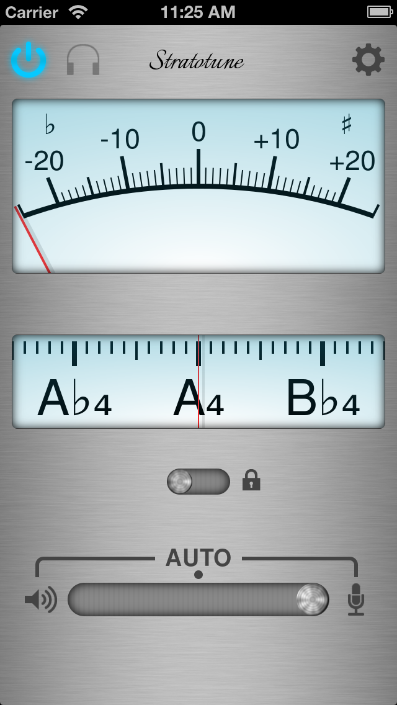

# Stratotune

Developed using [Xamarin C#](https://dotnet.microsoft.com/en-us/apps/xamarin), Stratotune was a chromatic tuner application for musical instruments which was available in the iTunes AppStore.

    

## Current Status

Stratotune was originally written by Chris Bayliss and has been imported to git from the original Mercurial repository. It is no longer actively maintained and would require some work to operate with the latest iOS and Xamarin versions.

## Summary

- Developed using the [Xamarin C#](https://dotnet.microsoft.com/en-us/apps/xamarin) cross-platform mobile app development platform.
- Pitch detection using an [autocorrelation](https://en.wikipedia.org/wiki/Autocorrelation) algorithm in realtime.
- Front end graphics generated using SVG source images composited using [ImageMagick](https://imagemagick.org/index.php).
- Uses a local Pub/Sub message bus architecture to decouple front and back-end services.

## License

Please see [LICENSE](./LICENSE).